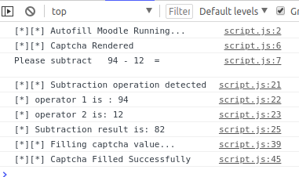

# Autofill-Moodle
A chrome extension which auto-fills the captcha in moodle and internal website webmail of IIT Delhi.

## Usage

This has not been uploaded to chrome-web-store, hence to put this extension in your browser, follow the steps given below - 
1. Clone the repository as - 
`
git clone https://github.com/techcentaur/Autofill-Moodle
`.
2. Go to the url `chrome://extensions` or click upon >>> More Tools >>> Extensions.
3. Click on the 'Load Unpacked' button on the top and open the folder of the cloned repository.
4. You can see a moodle icon at the extension-bar. Now, the script will automatically run when you visit the websites. Cheers!

## Files usage

#### manifest.json
This file is necessary for making the script run as a chrome extension, it essentially tells the detailed information like which script to run, which pop-up to made, which icon to display et cetra.

#### script.js
This file renders the captcha of moodle, solves it and then fill it on the website. You can also see its work in the console as -

#### webmail.js
This file renders the captcha of webmail and solves it. There are some internal code lines which can output the communication channel when uncomments, which otherwise are redundant.

## Contributing
Found a bug or have a suggestion? Feel free to create an issue or make a pull request!

### Attention
If you are one of the developers of these websites, try to make the captcha more challenging.
